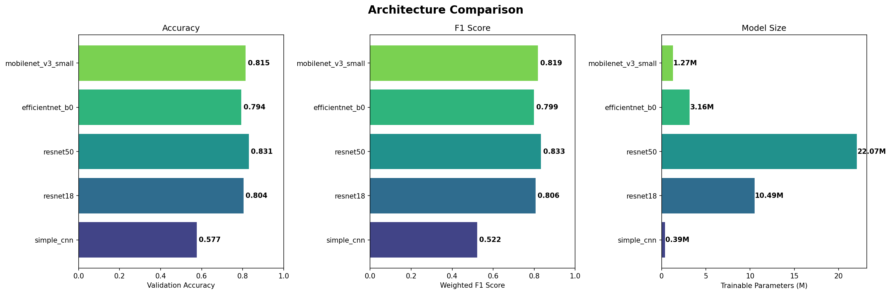

# Automated Aerial Rooftop Classification

This repository contains the end-to-end Computer Vision and Deep Learning pipeline for identifying, extracting, and classifying rooftop topological structures (Gable, Hip, Flat) from large-scale satellite imagery.

## 🚀 Project Overview
Working with unannotated aerial building masks presents mathematical and scaling challenges. This project solves that via a comprehensive 3-step engineering pipeline:
1.  **Computer Vision Extraction:** Utilizing OpenCV Connected-Component algorithms iteratively over geospatial masks to mathematically snap bounding coordinates to roofs and extract isolated image tensors.
2.  **Custom Web Tooling:** A lightweight, high-performance Flask web application designed for rapid keyboard-driven dataset annotation, allowing for the generation of a pristine 100% human-verified Ground Truth labeling dataset.
3.  **Deep Learning Ablation & Classification:** Employing PyTorch to run comprehensive Architectural and Hyperparameter Ablation Studies over the visual crops to construct a highly optimized `ResNet18` and `MobileNetV3` deployment capable of correctly determining topology.

---

## 📂 Repository Structure

### 1. Data Processing Pipeline
*   `filtering_images.py` - Scans the raw satellite map masks and computationally filters images lacking rooftop density to prevent empty compute operations.
*   `extract_rooftop_crops.py` - Connects components from the binary masks to slice and extract the `2,400+` padded rooftop subsets into the dataset.
*   `tif_to_jgp.py` - Normalizes geospatial `.tif` mask outputs into standard channels for CNN input.

### 2. Annotation Front-End
*   `labeling_tool.py` - The custom Flask backend that serves a rapid-annotation UI locally, tracking annotation status, class distributions, and dynamically building the verified `labels.json` dataset map.

### 3. Classification Engine
*   `train_classifier.py` - Natively compiles the `ResNet18` model, utilizing advanced Data Augmentation algorithms (rotation invariance, color jittering) and Weighted Label Samplers to beat the inherent class skew.
*   `test_classifier.py` - Pulls the trained `rooftop_classifier.pth` weights and executes a final benchmark Evaluation across the 100% human-verified validation set, ultimately achieving **85.8% Final Accuracy**.

### 4. Ablation Study & Results
*   `/study_results/` - A directory showcasing 9 algorithmically generated PNG insight graphs created during the rigorous Deep Learning evaluation constraints.
*   `Rooftop_Classification_Study.ipynb` - The massive 6-Part Master Evaluation notebook encompassing 6 separate mathematical deep-dives (Architectural tests, Augmentation, Freeze Layer mechanics, and Resolution scale correlations).

---

## 📊 Key Findings

During the extensive Ablation sweep, the architectural capabilities of standard Neural Networks were charted when processing overhead aerial shapes:



1.  **The Transformer/ConvNeXt Push:** The study demonstrates that lightweight edge-deployment models like `MobileNetV3` (1.2M params) perform remarkably well (81.5% accuracy) against heavily parameterized architectures natively, making them ideal for drone-based deployment operations.
2.  **Inherent Label Constraints:** The models strictly mandated rotation-inclusive geometric augmentations and Weighted Random Samplers due to the lack of spatial gravity in overhead satellite shots and Hip-to-Flat topological skew.

## 🛠️ Usage
1. Clone the repository and install requirements: 
   ```bash
   pip install -r requirements.txt
   ```
2. Unzip your crops into the `/Rooftop_Crops/` directory.
3. Open `Rooftop_Classification_Study.ipynb` via Jupyter/Colab to execute the real-time architectural evaluations.
